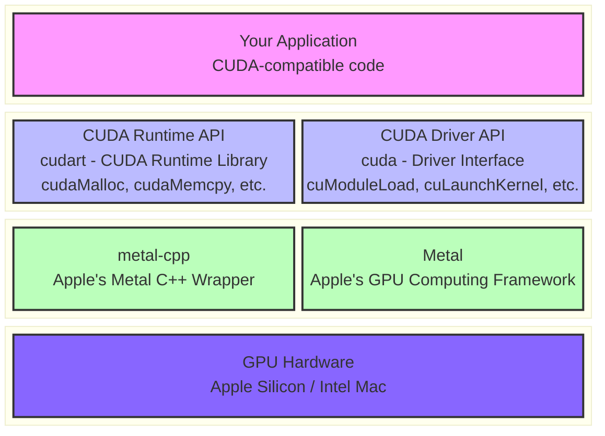

# MUDA - CUDA on Metal

<div align="center">


**A CUDA-compatible API implementation for macOS using Apple's Metal framework.**

</div>

---

## 📋 Overview

MUDA provides a CUDA-like programming interface that runs on macOS by leveraging Apple's Metal framework. This project enables CUDA applications to be ported to macOS with minimal code changes, bridging the gap between NVIDIA CUDA and Apple's Metal compute capabilities.

### 🎯 Goals

- ✅ Provide CUDA runtime API compatibility layer
- ✅ Enable CUDA code migration to macOS/Metal
- ✅ Support FFT operations via Apple's vDSP
- ✅ Maintain familiar CUDA programming patterns

---

## 🏗️ Architecture



---

## 🚀 Getting Started

### Prerequisites

- **macOS 12.0+** (Monterey or later)
- **Xcode 14.0+** with command-line tools
- **Apple Silicon** (M1/M2/M3) or **Intel Mac with Metal**

### Building

```bash
# Clone the repository
git clone https://github.com/yourusername/muda.git
cd muda

# configure
cmake -B build

# build
cmake --build build

```

### Basic Usage

```cpp
#include <cuda.h>
#include <cuda_runtime_api.h>

int main() {
    // Initialize CUDA
    int deviceCount;
    cudaGetDeviceCount(&deviceCount);

    if (deviceCount == 0) {
        return CUDA_ERROR_NO_DEVICE;
    }

    // Set device
    cudaSetDevice(0);

    // Allocate memory
    float* d_data;
    cudaMalloc(&d_data, sizeof(float) * 1024);

    // Load and launch kernel
    CUmodule module;
    cuModuleLoad(&module, "mykernel.metallib");

    CUfunction kernel;
    cuModuleGetFunction(&kernel, module, "myKernel");

    cuLaunchKernel(kernel, 1, 1, 1, 256, 1, 1, 0, nullptr, nullptr, nullptr);

    // Cleanup
    cudaFree(d_data);
    cuModuleUnload(module);

    return cudaSuccess;
}
```

---

## 🔧 Metal Shaders

MUDA requires Metal shader libraries (`.metallib` files). Compile your shaders using `metal`:

```bash
# Compile .metal to .metallib
xcrun metal myshader.metal -o myshader.air
```

### Shader Example

```metal
#include <metal_stdlib>
using namespace metal;

[[kernel]] void myKernel(device float* data [[buffer(0)]],
                     uint id [[thread_position_in_grid]]) {
    data[id] = data[id] * 2.0f;
}
```

---

## 📊 Limitations

- ⚠️ **NVIDIA-specific features** (Tensor Cores, cuBLAS, cuDNN) are not available
- ⚠️ **PTX assembly** is not supported; use Metal Shading Language
- ⚠️ Some advanced CUDA features may have different semantics
- ⚠️ Performance characteristics differ from NVIDIA GPUs

---

## 🆚 CUDA vs Metal Error Mapping

| CUDA Error | Metal Error |
|------------|-------------|
| `CUDA_ERROR_INVALID_PTX` | `MTLLibraryErrorCompileFailure` |
| `CUDA_ERROR_INVALID_IMAGE` | `MTLLibraryErrorUnsupported` |
| `CUDA_ERROR_FILE_NOT_FOUND` | `MTLLibraryErrorFileNotFound` |
| `CUDA_ERROR_NOT_FOUND` | `MTLLibraryErrorFunctionNotFound` |

---

## 🤝 Contributing

Contributions are welcome! Please read our contributing guidelines before submitting PRs.

### Development Notes

1. **Do NOT modify `metal-cpp/`** - This is Apple's official wrapper
2. Follow the existing code style
3. Add tests for new functionality
4. Update documentation accordingly

---

## 📝 License

This project is licensed under the MIT License - see the [LICENSE](LICENSE) file for details.

---

## 🙏 Acknowledgments

- **Apple** for Metal and metal-cpp
- **NVIDIA** for the CUDA API specification
- **Apple's Accelerate framework** for vDSP FFT implementation

---

<div align="center">

**Made with ❤️ for the macOS GPU computing community**

</div>
